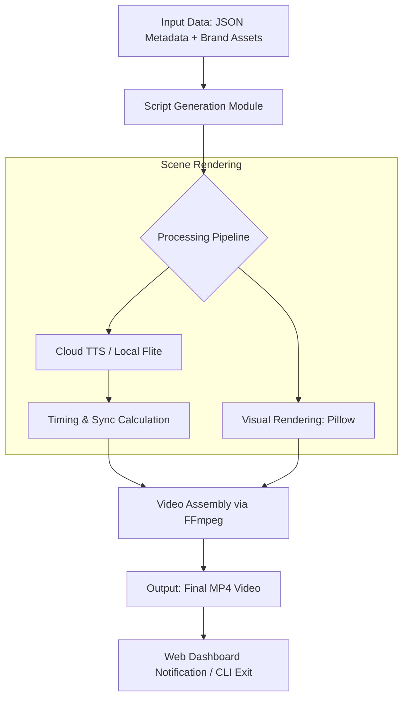

# FrameForge Architecture

FrameForge uses a decoupled, multi-stage pipeline processing architecture to prevent arbitrary limits on video generation.

## Tool/API Choices

* **Google Gemini API**: Used for advanced script generation and high-quality Neural TTS. Selected for its fast inference speed and natural voice prosody.
* **ElevenLabs**: Serves as a premium fallback neural TTS provider.
* **FFmpeg**: Industry standard for robust, frame-accurate video multiplexing and hardware acceleration.
* **Flask**: Provides a lightweight, accessible web dashboard for non-technical users.
